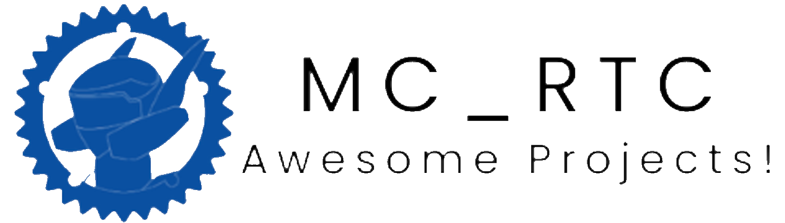

# 

  
  <h1 align="center">Awesome mc_rtc Projects</h1>
  
A curated list of awesome controllers, plugins, interfaces, and more for <a href="https://jrl-umi3218.github.io/mc_rtc/">mc_rtc</a> (Multi-Contact Robot Task Controller).

  

    
    
    
  

---

## 📦 Table of Contents

* [Categories](#categories)
  * [Controllers](#controllers)
  * [Plugins](#plugins)
  * [Tasks](#tasks)
  * [Interfaces](#interfaces)
  * [Robot Lists](#robot-lists)
  * [Others](#others)
* [Contributing](#contributing)
* [Tags](#tags)
* [License](#license)

---

## 📂 Categories

### 🎮 Controllers

> Custom controllers built with mc\_rtc.

* [posture_datastore_controller](https://github.com/bastien-muraccioli/posture_datastore_controller) let the robot follow joints position that are written in the datastore (compatible with [mc_ros_posture_pub_sub](https://github.com/bastien-muraccioli/mc_ros_posture_pub_sub)).

* [collision_benchmark_controller](https://github.com/bastien-muraccioli/collision_benchmark_controller) an FSM made for the Kinova Gen3 that generates different trajectory to test collision detection plugins.

* [monodzukuri2024_kinova_demo](https://github.com/bastien-muraccioli/monodzukuri2024_kinova_demo) an advanced FSM for the Kinova Gen3 that showcases different torque controlled based compliant modes by using a DS4 controller.

### 🧩 Plugins

> Extend mc\_rtc capabilities with plugins!

#### Observers
* [mc_residual_estimation](https://github.com/mathieu-celerier/mc_residual_estimation) a torque sensor based momentum residual estimator that estimates the external forces applied on a robot. Bonus feature, a complementary filter is used to fusion direct measurements from an F/T sensor.

* [mc_super_twisting](https://github.com/bastien-muraccioli/mc_super_twisting) a super-twisting based external forces estimator.

* [mc_collision_detection_jerk](https://github.com/bastien-muraccioli/mc_collision_detection_jerk) IMU based jerk estimator used to detect collisions.

* [mc_energy_residual](https://github.com/bastien-muraccioli/mc_energy_residual) estimates the kinetics residual energy to obtain torques.

* [mc_current_residual](https://github.com/bastien-muraccioli/mc_current_residual) estimates the momentum-based residual based on the motor currents to obtain torques. 

* [mc_collision_detection_zurlo](https://github.com/bastien-muraccioli/mc_collision_detection_zurlo) a plugin implementing the method from the paper Collision Detection and Contact Point Estimation Using Virtual Joint Torque Sensing Applied to a Cobot by Zurlo 

* [mc_collision_monitoring_birjandi](https://github.com/bastien-muraccioli/mc_collision_monitoring_birjandi) a plugin implementing the method from the paper Observer-Extended Direct Method for Collision Monitoring in Robot Manipulators Using Proprioception and IMU Sensing, by Birjandi 

#### Ros Integration
* [mc_ros_posture_pub_sub](https://github.com/bastien-muraccioli/mc_ros_posture_pub_sub) plugin to subscribe, publish and share posture between mc_rtc and ros interface.

* [mc_ros_force_sensor ](https://github.com/bastien-muraccioli/mc_ros_force_sensor) can be used to access any ROS message related to force/torque sensor data, including wrench messages.

* [mc_ros_imu_sensor](https://github.com/bastien-muraccioli/mc_ros_imu_sensor) can be used to retrieve any ROS IMU message with angular velocity and linear acceleration.

#### Miscellaneous

* [mc_joystick_plugin](https://github.com/bastien-muraccioli/mc_joystick_plugin) plugin to interact with a joystick controller, such as DS4 or Xbox controller.

### 🧠 Tasks

* [Torque Task](https://github.com/Alhuuin/mc_rtc) a fork of mc_rtc that allows to control the robot directly by torques.
* [Minimum Jerk Task](https://github.com/mathieu-celerier/MinimumJerkTask) a standalone task project that implements a closed-loop minimum jerk task.

### 🖥 Interfaces

> Tools to visualize or interact with mc\_rtc controllers.

* [mc\_rtc\_web\_interface](https://github.com/bastien-muraccioli/mc_rtc_web_interface)
  Modern web dashboard with live plots and controller management.
  `#web #dashboard #gui`

### 🤖 Robot Lists

> Catalogs of robots supported by mc\_rtc, that are not mentioned in the [official website list](https://jrl.cnrs.fr/mc_rtc/robots.html):

* [Kinova Gen3](https://github.com/mathieu-celerier/mc-kinova-sim-superbuild) Lightweight collaborative robotic arm with 7 DoF and torque sensors.

### ⚙️ Others

> Miscellaneous projects: superbuilds, CI configs, examples.

* [mc\_rtc\_superbuild](https://github.com/jrl-umi3218/mc_rtc_superbuild)
  Meta-build for downloading and building all mc\_rtc dependencies.
  `#superbuild #cmake #meta`

---

## 🤝 Contributing

Contributions are welcome! Please:

1. Fork the repo
2. Add your project under the appropriate category with:

   * **Name**
   * **Link**
   * **Short description**
   * **Tags** (like `#controller`, `#plugin`, etc.)
3. Submit a Pull Request

See [CONTRIBUTING.md](CONTRIBUTING.md) for detailed guidelines.

---

## 📄 License

This list is licensed under the [MIT License](LICENSE).
